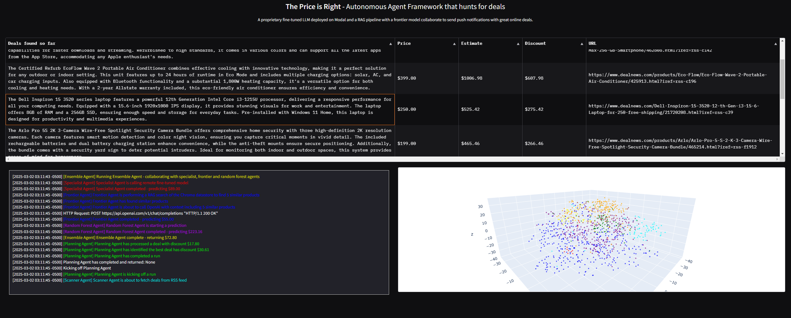
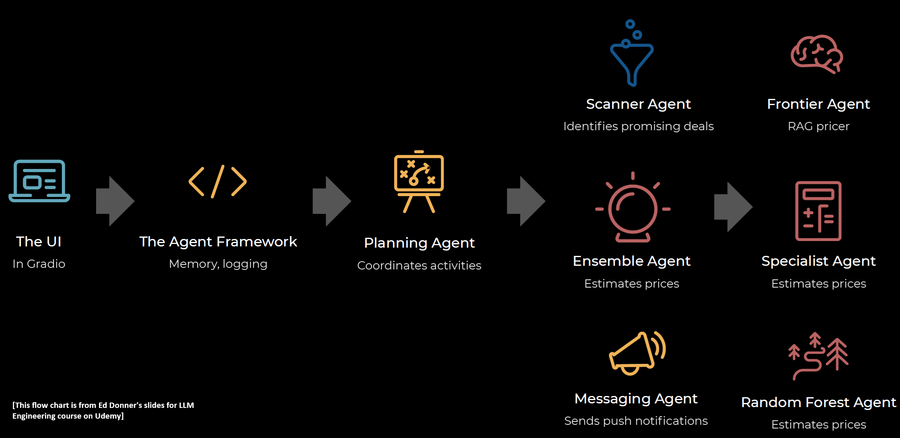

# llm-agent-pricer
This repo contains an organized version of the code for an Agentic AI solution for finding the best deals with high-quality item description from deals RSS, and pushed to your smart phone with a notification. Shout out to Ed Donner and his dedication to the [LLM engineering course](https://www.udemy.com/course/llm-engineering-master-ai-and-large-language-models/?srsltid=AfmBOopPit1vBlOvCfsp9V4Qk9iFH-3uYEEYgSychfy89DmYpj9V6iWX) with amazing projects. This repo aims for a clean implementation related to the LLM fine-tuning portion of the class projects. The code for the entire class (mostly jupyter notebooks) can be found [here](https://github.com/ed-donner/llm_engineering).






## Setup

The project requires not only your local python environment, but some online service as well. Make sure to sign up for these services during your setup. See instructions below.

### Python environment
This implementation is base on `Python>=3.11.10` environment. To install the dependent packages for this implementation for `Python 3.11.10` environment, run
```
pip install -r requirements.txt
```
or
```
conda env create -f environment.yml
```
If error occurs during the environment setup using these commands, more detailed setup instructions can be found [here](https://github.com/ed-donner/llm_engineering).

### Modal setup
Create an account at [modal](https://modal.com/). For the first time running the project, run the command below

```
modal setup
```

For windows users, also run the below command

```
modal token new
```

### Pushover setup
Create an account at [Pushover](https://pushover.net/). Add the following into your token collection file such as `.env`, with the huggingface token and other tokens.
```
PUSHOVER_USER=xxx
PUSHOVER_TOKEN=xxx
```

## Running the project

### Dataset

First, download the preprocessed dataset. The easier way is to download the datasets shared by Ed Donner [here](https://drive.google.com/drive/folders/1f_IZGybvs9o0J5sb3xmtTEQB3BXllzrW).

Alternatively, you can checkout how we curate the price dataset [here](https://github.com/ljaiverson/llm-fine-tuning-pricer), clone the repo and curate the dataset yourself by running
```
python dataset_curation.py
```

### Knowledge base (Chroma)

Next, run the following command to create the knowledge base for Retrieval-Augmented Generation (RAG) as SentenceTransformer embedded text features for the samples in our training set.
```
python create_RAG_knowledge_base.py
```

### Deploy fine-tuned LLM

Run specialist pricer (fine-tuned model) modal.
```
modal deploy pricer_service
```

### Train models (RF and Ensemble)

Train random forest model and ensemble model (of frontier agent (GPT with RAG), specialist agent (fine-tuned Llama), and random forest agent).
```
python train_RF_and_ensemble.py # requires fine-tuned model already deployed on modal
```

### Running the deal recommender application

With all agents ready, run the following to start the app with Gradio UI.
```
python price_is_right.py
```
